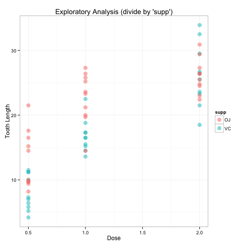

## Introduction

This presentation is completed within the Coursera 'Developing Data Products' course in order to present the ShinyApp developed within the overall Course project for the course.

1. The ShinyApp can be found at: (https://martincote.shinyapps.io/devdataproducts)[https://martincote.shinyapps.io/devdataproducts]
2. The code (for both the app and this presentation) can be found on GitHub at: (https://github.com/MartinCote1978/devdataproducts-courseraproject.git)[https://github.com/MartinCote1978/devdataproducts-courseraproject.git]
3. The presentation itself was the published on RPubs at: (http://rpubs.com/martincote/devdataproducts)[http://rpubs.com/martincote/devdataproducts]

--- .class #id 

## ToothGrowth Dataset & Predictive Model

The ToothGrowth dataset is a standard dataset provided within the R environment.

### Description

The response is the length of odontoblasts (teeth) in each of 10 guinea pigs at each of three dose levels of Vitamin C (0.5, 1, and 2 mg) with each of two delivery methods (orange juice or ascorbic acid).

### Format

A data frame with 60 observations on 3 variables.

1. [,1] len numeric Tooth length
2. [,2] supp	factor	Supplement type (VC or OJ).
3. [,3] dose	numeric	Dose in milligrams.

--- .class #id 

## User Guide to the Tooth Growth Predictor ShinyApps

Using the ShinyApp is extremely simple.

Steps:

1. Input the dose, using the slider bar, for a number between 0 and 3.
2. Input the supplement type, using the radio button, for the type where OC is Orange Juice and VC is Ascorbic Acid.
3. Click the Submit button.

--- .class #id 

## Original Statiscal Exploratory Analysis - Plot & Reference

 

